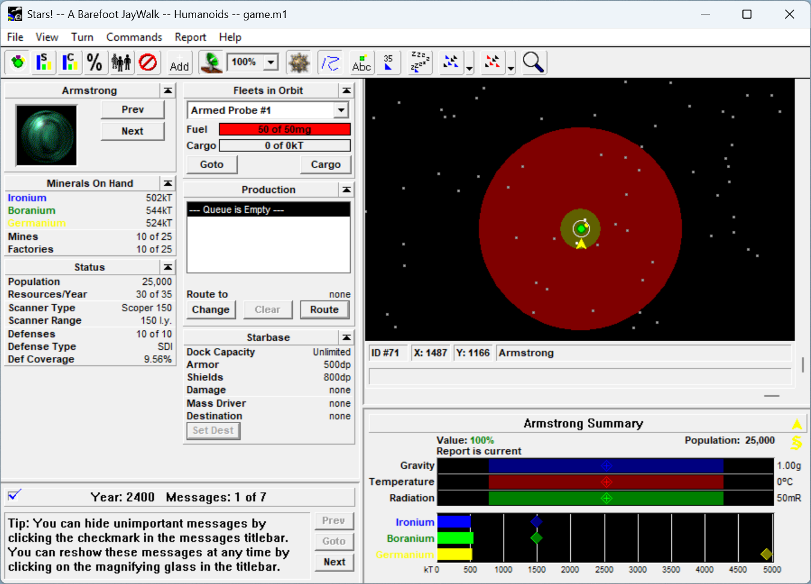

# Stars!VM

Runs the 16-bit Windows game **[Stars!][] 2.70j** on modern Windows by
translating it. 64-bit Windows has no NTVDM and cannot execute 16-bit code
at all, which is the version nearly everyone now runs. Stars!VM interprets
the game's machine code itself and its Win16 API calls in terms of Win32,
so it does not care what the host still supports.



It is in the same business as [otvdm/winevdm][otvdm], but not the same
kind of thing. otvdm is a general Win16 implementation, built on Wine's
code, that aims to run any Win16 program. This is written from scratch and
aims to run exactly one: every decision is allowed to be settled by what
Stars! 2.70j actually does, which is the only reason 13,000 lines is
enough. Where the two differ, that is usually why — an API this needs to
get exactly right is one the game exercises, and an API it can stub is one
the game never calls.

[otvdm]: https://github.com/otya128/winevdm
[Stars!]: https://en.wikipedia.org/wiki/Stars!

What is in the box:

- a 16-bit x86 interpreter (`src/cpu.c`) covering 8086/80186/80286 plus the 386
  additions a 16-bit MS C compiler emits, differentially tested against the host
  CPU by `make fuzz`, which builds and runs a separate program for the purpose.
  An encoding it does not understand stops the machine rather than guessing
- an x87 FPU emulator (`src/fpu.c`), which the game's C runtime requires
- an NE (New Executable) loader: segments, relocations, resources, the entry
  table
- a protected-mode selector model — a reserved arena in which a selector index
  picks a 64 KB slot, so guest far-pointer and huge-pointer arithmetic works
  unchanged
- Win16 → Win32 translation for KERNEL, USER, GDI, COMMDLG, TOOLHELP, WIN87EM,
  MMSYSTEM and WAVEMIX — all 209 imports the game uses, none stubbed
- native routines for the game's hottest code (`src/native.c`), patched over
  it at load and checked against the interpreter on demand, which is what
  makes turn generation fast; see "Turn generation" below

To build and play from source you will need:

- [`stars27jrc3.zip`][dl], just `stars.exe`
  (MD5: `654f494482c7904c4f0f265d6c081582`)

[dl]: https://wiki.starsautohost.org/wiki/Downloads

## One file, nothing to install

The emulator runs a module appended to its own executable, so the game and the
shim become a single program:

```bash
make onefile
```

That writes `Stars-x86.exe`, and that file is all you need — no DLLs, no
install, no registry. `Stars.ini` is created beside it on first run, which is
also where the game keeps its settings and its registration.

The game is compressed on the way in: 3,153,152 bytes become 1,071,307, so the
one file is about 1.2 MB where concatenating the two plainly gives 3.3 MB. It
costs 68 ms of decompression at startup and about 250 lines in the emulator.
`src/pack.h` describes the format and records what was measured to arrive at
it, including the several plausible ideas that turned out to make the file
bigger.

The result can be signed, and signing has to come last. Authenticode puts the
certificate at the very end of the file, so on a signed build the trailer is no
longer the last thing there — the loader reads the PE's security directory to
find where the certificate starts and looks for the trailer in front of it.
Appending to an already-signed emulator is the mistake in the other direction:
the payload would fall outside what the signature covers, and Windows rejects a
file with anything past the certificate table, so the packer says so.

A plain `cat StarsVM.exe stars.exe >Stars-x86.exe` still works and still runs.
The loader takes whichever it is given: a compressed payload identifies itself
by a trailer at the end of the file, and failing that the old scan looks for an
MZ header whose `e_lfanew` points at a valid NE. Neither depends on arithmetic
over where our own binary ends — which is just as well, since that moves when
the linker strips symbols — and every offset inside the module stays relative
to the module, so a plainly appended payload can still land anywhere.

## Running it

With no argument, the game is looked for in three places, in order:

1. a path given on the command line
2. a module appended to the emulator's own executable
3. the `stars.exe` sitting beside the emulator

Stars! itself is not included and is not redistributable — supply your own copy.

The game has switches of its own. Everything starting with `-` before a `--` is
the emulator's, so the game's go after it:

```bash
StarsVM.exe -- -g10 game.hst
```

That is the game's batch mode: ten turns from a host file, then exit. A
file the game names without a path is looked for beside the module first and
then in the current directory, so a game can live beside `stars.exe` or
wherever it was started from; its turn files are written back where its host
file was found.
`--help` lists the rest. One of them, `-x`, asked 16-bit Windows to shut the
machine down when the game quit; here it does nothing.

## Building

Built with [w64devkit][w64]. 32-bit is the primary target:

```bash
make
```

64-bit is a recompile rather than a rewrite:

```bash
make CROSS=
```

Both produce a working emulator. The build is a unity build — `src/unity.c`
includes every other source, and the Makefile compiles only that — so the
compiler sees the whole program at once, which matters because the interpreter
loop reaches into the selector and thunk layers on every instruction. The
individual sources are still ordinary `.c` files and each still compiles
standalone, so `gcc -c src/cpu.c` remains available when bisecting a warning.

It is built `-O3`, which is a deliberate reversal. The emulator was built `-Oz`
for a long time, and on an 888-line dispatch switch whose every helper is a
`static` function and whose memory accessors are `static inline` in a header,
optimising for size cost about a third of its speed. Measured on ten generated
turns of a Huge, packed, 16-player game:

| | rate | executable |
|---|---|---|
| `-Oz` | 49.4 M instructions/s | 148 KB |
| `-Os` | 50.5 M/s | 150 KB |
| `-O2` | 74.6 M/s | 267 KB |
| `-O3` | 82.9 M/s | 343 KB |

All four generate byte-identical turn files, so that is one emulator built four
ways rather than four emulators. `-O3` costs 195 KB over `-Oz` — about a sixth
of the packed one-file build — and buys 1.68x. `-O2` is the smaller binary for
most of the gain, if that trade is ever wanted.

`make onefile` builds `StarsVM-pack.exe` and runs it to produce the single-file
build described above. Like the fuzzer it is a separate program, so neither the
match finder nor the dynamic-programming parse that does the actual compressing
is anywhere near the emulator; all it ships is the decoder. It decompresses its
own output and compares it to the input before writing anything, so the two
halves of the format cannot drift apart without the build failing.

`make fuzz` builds a second, separate program, `StarsVM-fuzz.exe`, out of seven
of the same sources — the interpreter, the FPU, the selector arena, the log, and
the thunk layer that `cpu_step` needs in order to link. It differentially tests
the interpreter and the FPU against the host CPU — 200,000 rounds by default,
covering register, immediate, memory and string forms, integer and x87 alike.
For x87
the oracle seeds and dumps the whole 80-bit register stack with `FRSTOR` and
`FNSAVE`; for memory operands it works out the effective address independently
of `decode_ea` and aims the oracle at a mirror of the same byte, so the address
arithmetic is under test rather than assumed. It has nothing to say about the
game, so
it is not part of the emulator, and neither is `src/fuzz.c`: its oracle works by
writing machine code into a page it allocates `PAGE_EXECUTE_READWRITE` and then
calls. That is the only request for executable memory anywhere in the tree, and
keeping it in its own program means the emulator makes none at all — the
selector arena is reserved `PAGE_NOACCESS` and committed `PAGE_READWRITE`,
because guest code is interpreted rather than run. `StarsVM.exe` never asks the
system for a page it can both write and execute.

No filename in the tree contains a `!`. The project is called Stars!VM, but
GitHub will not take the character in a repository, release or artifact name,
and it is a history expansion in an interactive shell — so the binaries are
`StarsVM.exe`, `StarsVM-fuzz.exe` and `StarsVM-pack.exe`, the game is
`stars.exe`, and the one file you build for yourself is `Stars-x86.exe`.

[w64]: https://github.com/skeeto/w64devkit

## Turn generation

Everything the game does is quick except generating a turn, and the profiler
(`make prof`, then run the game; the report comes out at exit) says why in
one line: a quarter of every instruction executed comes from five basic
blocks, half from twenty. The hot code is a handful of small, closed pieces
of game logic run tens of millions of times — the nearest-object scan, the
habitability formula, the random generator, a few C runtime helpers — and the
interpreter's per-instruction cost is what they pay.

So those pieces are rewritten in C and patched over the guest code:
`src/native.c` holds the routines, `docs/natives.md` the disassembly each one
stands in for and what it must leave behind. The first byte of a site becomes
`0xD6`, an opcode no 16-bit compiler emits, and the interpreter dispatches it
to the routine. A routine may stop at any instruction boundary it likes — the
loop's head after the iterations it models, the start of a float tail — and
may decline, in which case the original instruction runs; either way the
machine is left exactly as the interpreter would have left it, dead stores
and stale register halves included, because that is what makes correctness a
mechanical test:

- `--verify-native N` runs, every Nth call, both the routine and the code it
  replaced from the same state and requires the interpreter to reach the
  routine's stopping point with the same registers, flags and memory. The same
  state at the same address means the same future.
- `tools/bench.ps1` (`make bench`) generates N turns with `--fixed-clock`,
  times them, and compares every output file byte for byte against a blessed
  run of the unpatched emulator (`--no-native`). A copy of a test game goes
  in `bench/orig/`, beside `stars.exe` and `Stars.ini`; see the script.

Measured on a Huge, packed, 16-player game, the time being the interpreter's
own from the first instruction to the last, with every output file identical:

| | 10 turns | 50 turns |
|---|---|---|
| `--no-native`, unbuffered files | 8.36 s | 89.7 s |
| eight routines | 4.42 s | 49.4 s |
| eight routines, buffered files | 3.81 s | 46.2 s |
| | 2.19× | 1.94× |

Eight routines stand in for 53% of the instructions of a ten-turn run and
49% of a fifty-turn one; what is left is spread thinner, and the profiler's
report — which ranks basic blocks and functions by instructions executed,
disassembles the top ones, names them by NE segment, and says where the
seconds went between the interpreter, the host API handlers, the x87 and the
string loops — is how the next site is chosen.

The last row is the file layer rather than the interpreter. Win16's `_lread`
was a DOS call and nothing more, and the game reads its files the way that
invites: a record's length word, its type word, then the record, one call
each, 36,000 reads and 11,000 writes per generated turn, none of them
seeking. Each was a `ReadFile` or `WriteFile`. A 16 KB buffer per handle,
read-ahead or write-behind, turns that into a few hundred; `src/api_dos.c`
says how it stays exact when two handles are the same file.

## Sound

The game's battle effects play. Stars! drove them through Microsoft's 1993
`WAVEMIX.DLL`, a software mixer from the days when a sound card could play one
stream; `src/audio.c` reimplements all eleven of its entry points on `waveOut`,
one device per channel, and lets Windows do the mixing. Nothing calls back into
guest code: every device is opened `CALLBACK_NULL` and finished buffers are
recycled by polling, driven from the `WaveMixPump` the game already calls
thirteen times per battle frame.

CD music is deliberately not implemented. The game's soundtrack was Red Book
audio on the retail disc, and it stores a track number and nothing else — there
is no music data anywhere to substitute. `mciSendCommand` reports "no such
device", which makes the game clear its music bit and stop asking. That is what
it did on a machine with no CD in 1995.

## Copy protection

Stars! stamps each submitted turn file with your serial code and an eleven-byte
fingerprint of the machine, and a host penalises one serial appearing under two
different fingerprints. The fingerprint is the volume label, label timestamp and
size of the drives at C: and D:. Stars!VM reported the wrong drive-type numbers
to the guest for a while, which silently reduced that fingerprint to a constant
— the same on every machine — and fixing it invalidates registrations made by
older builds, so the game asks for the serial code once more. `docs/copy-protection.md`
has the disassembly, the byte layout and the parts that are still not faithful.

## Known gaps

- **The decimal adjusts go untested on an x64 build.** The fuzzer runs in
  either mode, but it works by comparing the interpreter against the host CPU,
  and 64-bit mode deleted DAA, DAS, AAA, AAS, AAM and AAD outright — there is no
  oracle for them there. The run counts those rounds as unrunnable rather than
  as passes, and a 32-bit build covers them. Everything else is tested in both
  modes.
- **Guest-supplied paths are ANSI.** Paths the emulator owns — its own module,
  and `Stars.ini` — are wide throughout, so an installation under a directory
  the ANSI code page cannot spell works. Paths the *game* supplies still go
  through the code page, so a saved game under such a directory will not open.
  Fixing that means choosing an encoding for the guest's bytes.
- WinHelp and printing are stubbed. Modern Windows has no help viewer to
  forward to.

## Debugging

The emulator is a GUI binary. The modes that print and exit — `--help`,
`--dump`, `--imports`, `--peek` — borrow the console of the shell that started
them, or make one when there is none. The tracing modes run the game, which
does not borrow a console it might later be killed through, so they want
`--console` or `--log FILE`:

| | |
|---|---|
| `--trace-api` | log every Win16 call with its arguments |
| `--trace-cpu N` | log the first N instructions executed |
| `--trace-paint` | log update regions around painting, for repaint loops |
| `--dump`, `--dump-relocs` | print the NE structure |
| `--imports` | print the import thunk table |
| `--peek S:OFF:N` | hex-dump N bytes at segment S, offset OFF |
| `--disasm S:OFF:N` | disassemble N instructions from there, as `segS:OFF` lines |
| `--no-native` | patch in none of the native routines (see "Turn generation"): the A/B |
| `--verify-native N` | every Nth call of each native routine, also run the code it replaced and stop on any difference |
| `--play-wave N` | play a `WAVE` resource through the sound path and exit |
| `--survey` | keep going past unimplemented APIs instead of stopping |
| `--log FILE` | also write the log to a file |

`--help` lists them all. `tools/` holds PowerShell helpers for driving and
inspecting a running instance — the window tree, update regions, screenshots,
clicking and poking controls — and Python tools for dumping the game's dialog,
menu and icon resources.
